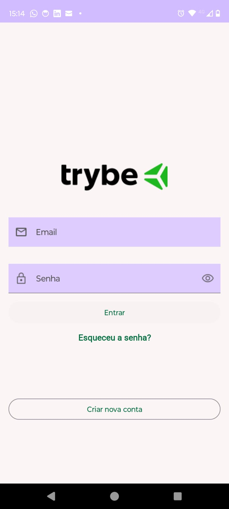
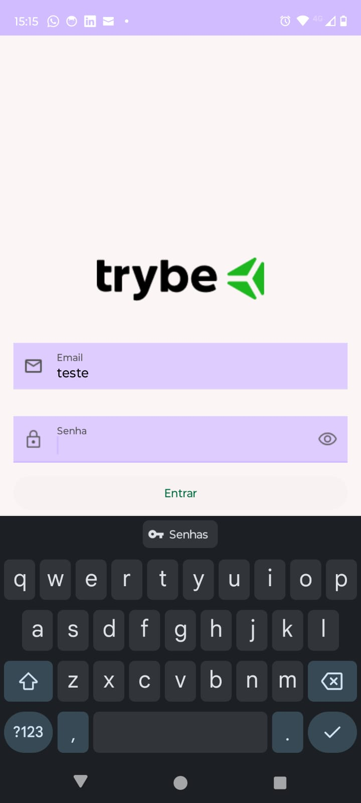
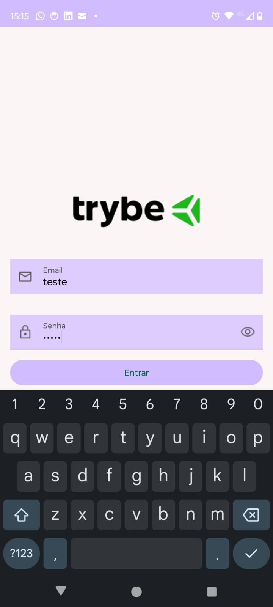
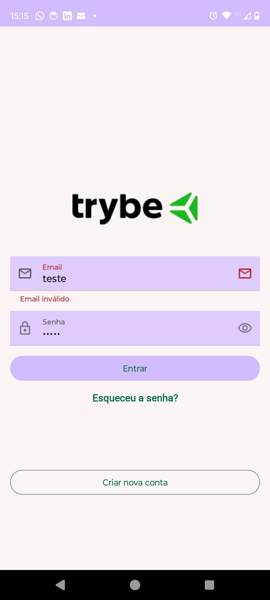
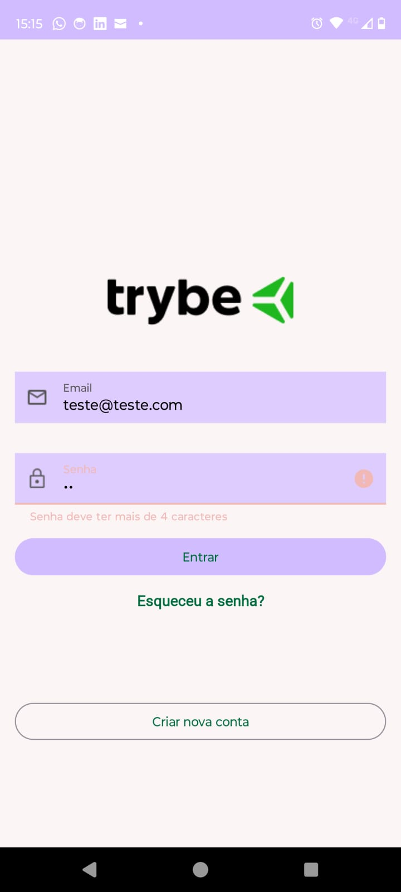
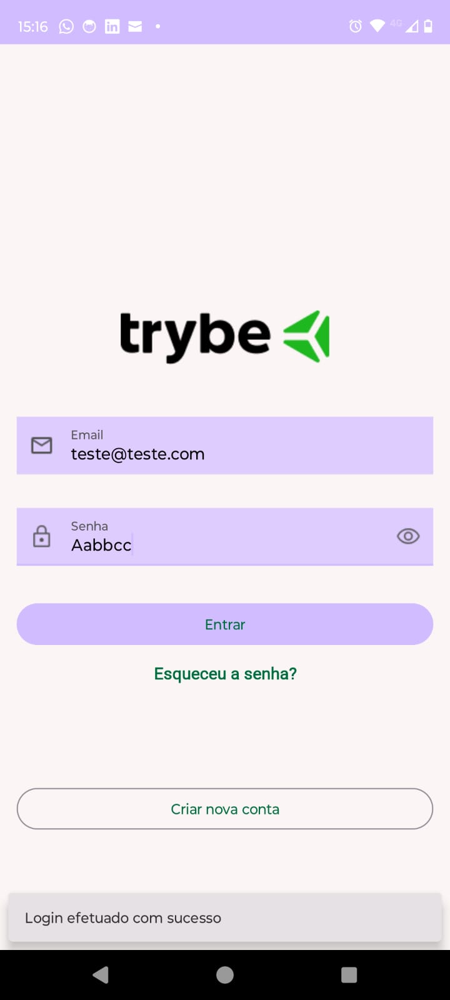

<h1>📱 Android Social Login</h1>

   

 Um projeto Android desenvolvido durante o curso de Aceleração Android da Trybe, demonstrando a implementação de uma tela de login de um aplicativo.

<h2>🔍 Visão Geral</h2>
 Este projeto tem como objetivo:
 ✅ A partir de um protótipo desenvolvido com Figma, desenvolver uma tela de login de um aplicativo Android.
 ✅ Validar que os campos "email" e "senha" tenham algum preenchimento para habilitar o botão "entrar"
 ✅ Validar que o campo "email" está preenchido com um endereço no formato válido
 ✅ Validar que o campo "senha" está preenchido com pelo menos 5 caracteres.
 ✅ Mostrar aviso em caso dados inválidos em cada campo.
 ✅ Mostrar mensagem de sucesso em caso de preenchimento com dados válidos.
 
<h2>🛠️ Tecnologias e Bibliotecas</h2>
 Linguagem: Kotlin
 
 SDK: Android (minSdk 21+)
 
 Autenticação: email e senha
 
 Gerenciamento de Dependências: Gradle
 
 Ferramentas: Android Studio
 
 <h2>⚙️ Configuração</h2>
 Pré-requisitos
 Android Studio (versão mais recente recomendada)
 
 Passos para Executar
 Clone o repositório:
 
 shell:
 git clone https://github.com/junior8319/trybe-prj-android-social-login.git
 Abra o projeto no Android Studio
 
 Execute o app em um emulador ou dispositivo físico
 
 <h2>📸 Imagens</h2>
<h3>Tela Inicial</h3>

 
<h3>Em preenchimento, botão desabilitado</h3>

    Demonstrando que o botão "Entrar" fica desabilitado até que os campos "Email" e "Senha" tenham algum preenchimento

 
<h3>Em preenchimento, botão habilitado</h3>

    Demonstrando que o botão "Entrar" fica habilitado quando há preenchimento dos campos "Email" e "Senha".

 
<h3>Validação, aviso de email inválido</h3>

    Demonstrando que o campo "email" fica com um aviso em vermelho caso esteja em formato inválido.

 
<h3>Validação, aviso de senha inválida</h3>

    Demonstrando que o campo "senha" fica com um aviso em vermelho caso não tenha ao menos 5 caracteres.

 
<h3>Mensagem de sucesso</h3>

    Quando o preenchimento é feito corretamente, uma mensagem de sucesso é exibida ao clicar no botão "Entrar".

 
 
 📌 Notas Adicionais
 
 ### 🎓 Contexto do Projeto na Trybe  
 Este projeto foi desenvolvido como parte da seção "Fundamentos do Desenvolvimendo Android" do curso Aceleração Android da Trybe, com o objetivo de aprender os fundamentos de desenvolvimento de layouts com Android Studio.
